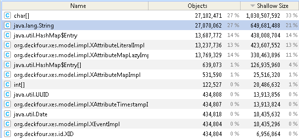

Recently, I wanted to apply some plug-ins of the Process Mining tool-set&nbsp;<a href="http://www.promtools.org/">ProM&nbsp;</a>on a real-life event log that contained a bit more attributes than the usual <i>concept:name</i> and <i>time:timestamp</i> for each event<i>. </i>This event log contained 155,000 cases and about 1.2 million events, each with 30 attributes. Definitely this is not a small event log, but it is also far away from being Big Data. The compressed XES file just takes about 17 MB of disk space.

The first step I wanted to do with ProM was to get rid of some of the attributes. I knew that there were some duplicates and unnecessary attributes. As I did not want to fiddle around with regular expressions and some text editor each time I would get an event log like this, I wrote a small ProM plug-in that allows to remove and manipulate attributes from an event log. (Now part of the <i>LogFiltering</i> package)

I started ProM and tried to open the event log with the option <i>ProM log files (Naive)</i>, assuming that a 5 GB memory limit should be enough for a 17 MB event log and my plug-in would be much faster than with the <i>ProM log files (Buffered)</i> option. After a few minutes all I got was a <i>java.lang.OutOfMemoryError: Java heap space :(.&nbsp;</i>

Trying again, this time with the option <i>ProM log files (Buffered)</i>, I could successfully load the event log, but most operation in my plug-in were painfully slow. Of course it was slow as the buffered implementation just loads a part of the event log into memory. Even worse, I assumed that iterating through the event log multiple times is fast and, therefore, did not optimize my plug-in for this type of disk-buffered implementation of OpenXES. 

Still, one thing kept me wondering:

<b>Why would an 17 MB event log take more than 5 GB of memory in ProM?</b>

Ok, to be fair, the uncompressed size of the event log was about 1 GB, still, why does 1 GB&nbsp;highly&nbsp;verbose XML results in <b>more</b>&nbsp;than 5 GB heap space usage in ProM? I used the YourKit profiler and had a look on how the naive XES implementation in ProM (OpenXES) handles event logs and created an alternative implementation in the XESLite package that uses less resources. If you don't want to read the whole story just grab the <a href="http://www.promtools.org/prom6/nightly/">ProM nightly build</a>, install the XESLite package and use the option <i>ProM log files (Unbuffered &amp; Lightweight) </i>to open a log file.

It appears that most memory is occupied by instances of <i>char[] </i>and <i>java.lang.String</i><i>. </i>Actually, most of the the 27 million <i>char[]</i> instances contain simply the real <i>String</i> data and the about 650 MB used for the <i>String</i> instances is just the overhead of having the <i>String</i> object. (Please note that in YourKit <a href="http://www.yourkit.com/docs/80/help/sizes.jsp">Shallow size</a> does not include the size of other references objects) Also noteworthy is that there are almost 14 million instance of the class <i>XAttributeMapLazyImpl</i> taking 330 MB of memory, but more about this one later.

Looking at the usual structure of an event log it is not surprising to see that a lot of the memory is taken up by instances of <i>java.lang.String. </i>After all, every attribute makes use of a String as <i>key</i>, and for most event logs every event contains the attribute <i>concept:name</i> with the name of the event. What may come as a surprise is that in the current OpenXES implementation, for every attribute there is a separate String instance storing the <i>key</i>. For my event log, that results in having the String "concept:name" stored <b>1,200,000 times</b> in the Java heap space. Certainly this is not desirable at all.

So how to fix this problem? There is a general design pattern called <a href="http://en.wikipedia.org/wiki/Flyweight_pattern">Flyweight</a> that should be followed here. In Java there is even a standard implementation for <i>java.lang.String</i> in the JDK that is <a href="http://docs.oracle.com/javase/6/docs/api/java/lang/String.html#intern()">String.intern()</a>. Java maintains an internal pool of Strings and the method String.intern() will return a String from this pool, if possible. Unfortunately, in Java 6 this mechanism is rather restricted, as the String pool resides in the PermGen memory and is generally not performing very well with a lot of Strings. Fortunately, the Guava project provides an easy to use alternative with the class <a href="http://docs.guava-libraries.googlecode.com/git-history/release/javadoc/index.html?com/google/common/collect/Interners.html">Interners</a>.

The second issue in the current (naive) OpenXES implementation is that for each attribute in my event log, there is an <i>XAttributeMapLazyImpl</i> taking up precious memory (330 MB in my case). This class just acts as a wrapper class for possible attributes of attributes, i.e. meta attributes, even though my event log does not contain any such meta attributes. One simple solution to this problem would be to just not allocate this wrapper class for each attribute, and, instead, require people to supply their own instance of <i>XAttributeMap</i> using the method <i>setAttributes(XAttributeMap map)</i>, in case meta-attribute are really needed. Unfortunately this change breaks a lot of existing code. Interestingly, <i>after</i> finishing my alternative implementation, I found out that Michael Westergaard already pointed out the <i>XAttributeMapLazyImpl&nbsp;</i>issue in this <a href="https://westergaard.eu/2011/05/how-much-memory-is-needed-to-store-a-log/">blog post</a>&nbsp;3 years ago.

I adressed both issues by creating an alternative XES implementation that is part of the ProM package <b>XESLite</b>.&nbsp;To use it, just grab the&nbsp;<a href="http://www.promtools.org/prom6/nightly/">ProM nightly build</a> and install&nbsp;<a href="http://www.promtools.org/prom6/packages/XESLite/">XESLite</a>&nbsp;using the&nbsp;package&nbsp;manager. Upon opening an event log there should be a few new options:

<ul>
	<li>Lightweight</li>
	<li>Lightweight &amp; Meta Attributes</li>
	<li>Buffered by MapDB</li>
</ul>

Pick <i>Lightweight</i> for an implementation that uses String interning for all the attributes keys, as well as for some of the attribute values. This should significantly reduce the memory usage for most event logs, while just adding a small overhead upon loading. The <i>Lightweight</i> implementation also removes all <i>XAttributeMapLazyImpl</i> instances, so it will show an error message if your event log contains meta-attributes. In that case you can still benefit from the String interning by using the <i>Lightweight &amp; Meta Attributes</i> implementation.

Using the <i>Lightweight</i> implementation my event log could be loaded in 65 seconds using just about 1.3 GB of memory instead of throwing a <i>java.lang.OutOfMemoryError</i> with a heap space limit of 5 GB. As you can see in the memory statistic below <i>java.lang.String</i> occupies way less memory and the <i>XAttributeMapLazy</i> instances are gone. There are some other changes, like replacing the UUID of an XEvent with a simple sequential Long and using the Trove THashMap instead of the memory wasting Java HashMap.

Of course, my event log contained a lot of duplicate Strings and may not be the best benchmark. Therefore, I run a small benchmark that shows the improvements that are to be expected in a more generic case. The benchmark script generates 12 million attributes distributed on 50,000 traces and 1 million events. Each event gets a set of standard attributes (timestamp, transition, name, resource) and 8 random attributes (2 literal, 2 discrete, 2 continuous, 2 boolean) . The literal values are randomly picked from a pool of 65,536 possible values to simulate the fact that event logs usually are not entirely random. After loading the event log, the <i>lightweight</i> implementation used <b>856 MB</b> of memory and the <i>naive</i> implementation used <b>2466 MB</b> of memory. Loading the event log in ProM took <b>90 seconds</b> with the lightweight implementation and, interestingly, <b>116 seconds</b> with the naive implementation. Initially, I assumed that the <i>Lightweight</i> implementation would be slower due to the String interning, but apparently&nbsp;the garbage collection of Java slows down the naive implementation much more than the small overhead of the <i>Interner</i>.

The third option <i>Buffered by MapDB</i> is an experimental implementation that uses a different back-end and a different strategy for disk-based buffering. It uses the <a href="http://www.mapdb.org/">MapDB project</a> to store a TreeMap of all attributes on disk. In contrast to the OpenXES buffered implementation, which buffers on the level of an event, the buffering is done on the level of a single attribute. Therefore, operations that use the log in a non-sequential way or use just a few attributes may benefit from this buffering strategy. Moreover, MapDB is an active open source project and we would get future improvements for free. I will share more details on the ideas behind the MapDB based implementation in my next blog post.
