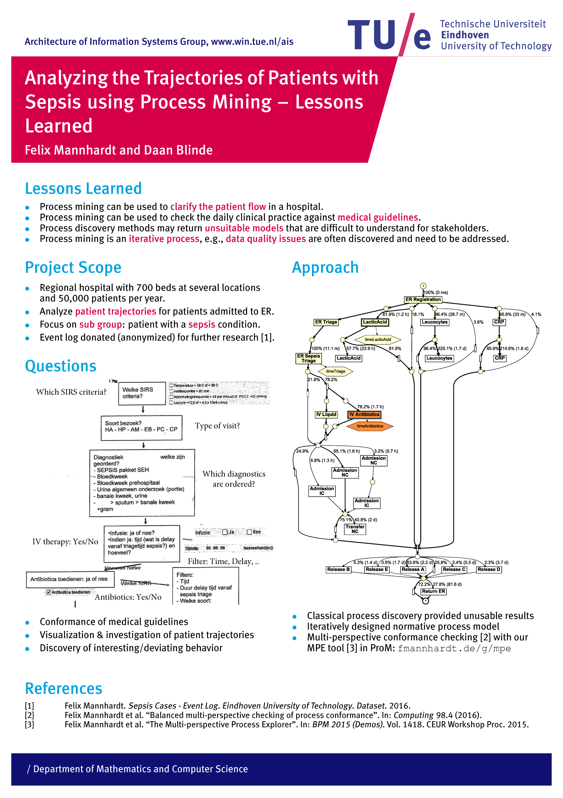
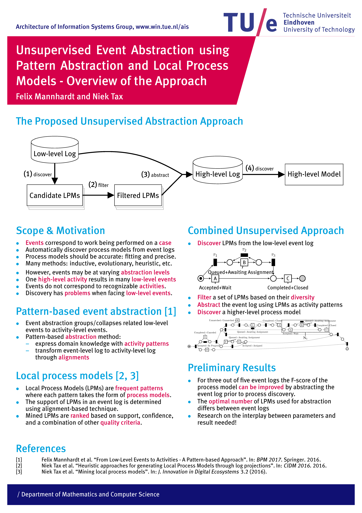

I just presented two poster versions of short papers at the <a href="http://www.bpmds.org">BPMDS conference</a>, which is co-located with the CAiSE conference in Essen. The two posters are available for download below. 

[Analyzing the Trajectories of Patients with Sepsis using Process Mining (Poster at BPMDS 2017)](2017-06 - Analyzing the Trajectories of Patients with Sepsis using Process Mining.pdf)

[Unsupervised Event Abstraction using Pattern Abstraction and Local Process Models (Poster at BPMDS 2017)](2017-06 - Unsupervised Event Abstraction using Pattern Abstraction and Local Process Models.pdf)