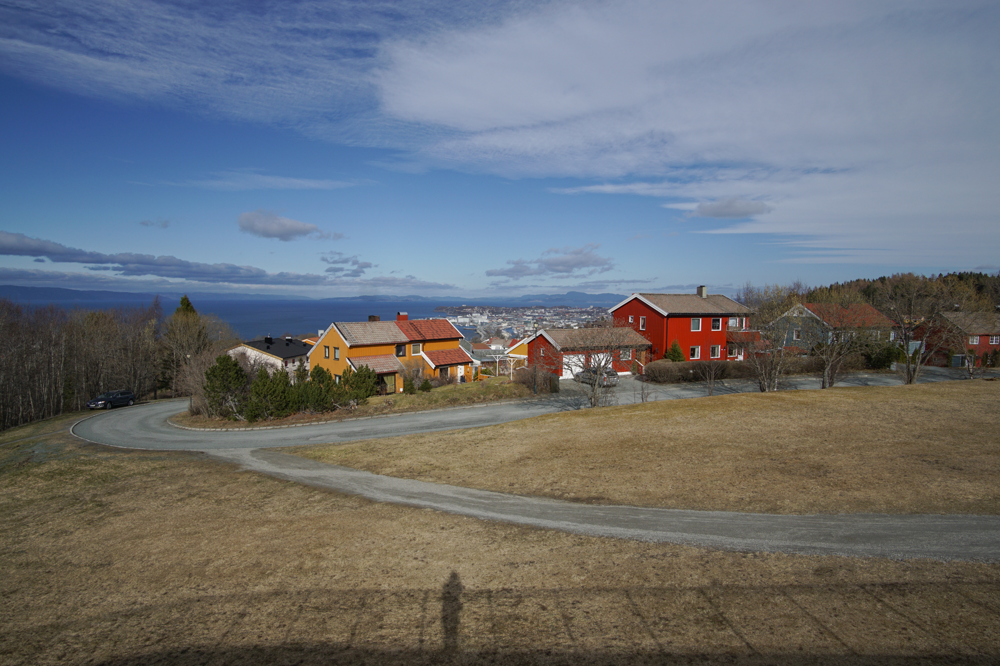
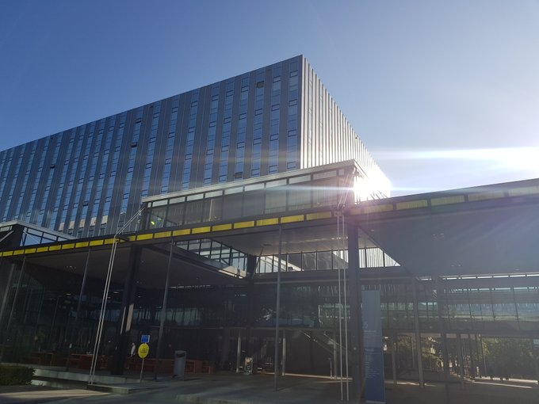

Since 1st September 2020, I moved back to Eindhoven due to personal reasons and started working as Assistant Professor in the Process Analytics group of Eindhoven University of Technology. I keep being involved in KIT-AR on a part-time basis and looking forward to collaborate with my previous research group at SINTEF Digital. Looking forward to be fully back on the academic track and hope to provide a few more blog posts in the coming months.

Goodbye Trondheim!

Hello again, Eindhoven!