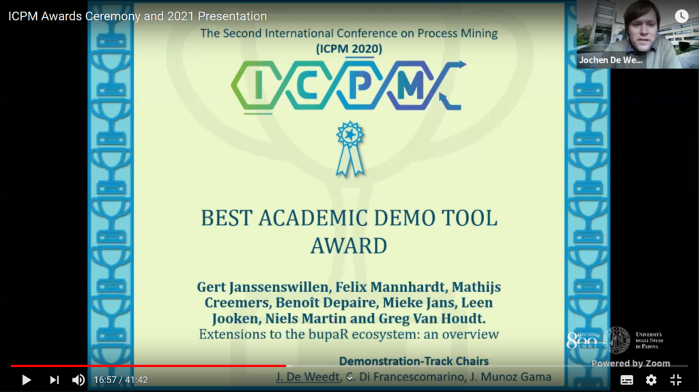

At the major Process Mining conference ICPM 2020 my joint work with Gert Janssenswillen (and many others) on the bupaR framework received recognition by being awarded the Best Academic Demo Tool Award. I contributed besides regular improvement and fixes for the core packages, the CRAN packages:

* [heuristicsmineR](https://github.com/bupaverse/heuristicsmineR)
* [processanimateR](https://github.com/bupaverse/processanimateR)

Recently, we moved bupaR to its own Github organisation called [bupaverse](https://github.com/bupaverse/). Everyone is warmly invited to take part in the development by proposing new features, bug reports, and so on. 

Thanks a lot to Gert Janssenswillen who lead the work on writing the [demo paper](http://ceur-ws.org/Vol-1920/BPM_2017_paper_193.pdf) and provided the virtual demo at ICPM 2020.