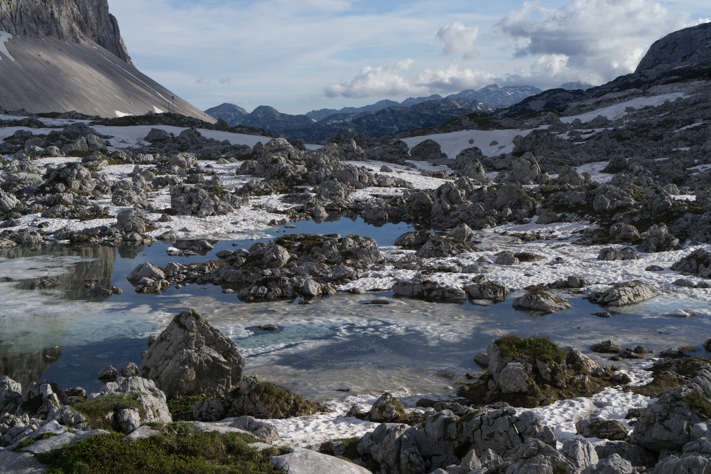

I am an Assistant Professor (Universiair Docent) at the Eindhoven University of Technology. I am researching and applying Process Mining in various settings and in conjunction with other Data Science and Machine Learning methods. My main research interest are the development and application of Process Mining methods related to low-level event data (event abstraction, activity recognition, sensor data, multi-perspective event logs), related to conformance checking (combination of control-flow with rules over data), as well as related to trust and privacy concerns (privacy-preserving methods, privacy and trust models).

In my private life, when not spending time with my family, I like to climb rock faces and be out in the mountains. 

