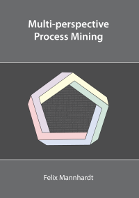

Early 2018, I received my PhD degree from the Technical University of Eindhoven based on my thesis **Multi-perspective Process Mining**. I worked in the [AIS group](http://www.win.tue.nl/ais/) and was supported by the awesome team of [Hajo A. Reijers](http://reijers.com), [Wil M.P. van der Aalst](http://vdaalst.com/), and [Massimiliano de Leoni](https://www.math.unipd.it/~deleoni/). 

  

The thesis provides in-depth description of several Process Mining techniques that deal with situations in which multiple process perspectives (control-flow, data, resource, time, etc.) are intertwined and considered together. If you just want to get an overview, here is an [extended abstract](http://ceur-ws.org/Vol-2196/BPM_2018_paper_9.pdf) summarizing the main contributions.
