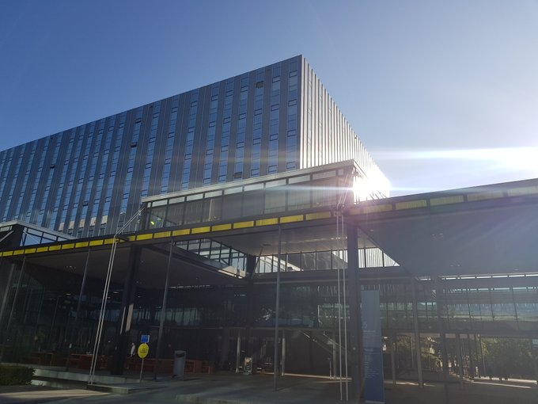
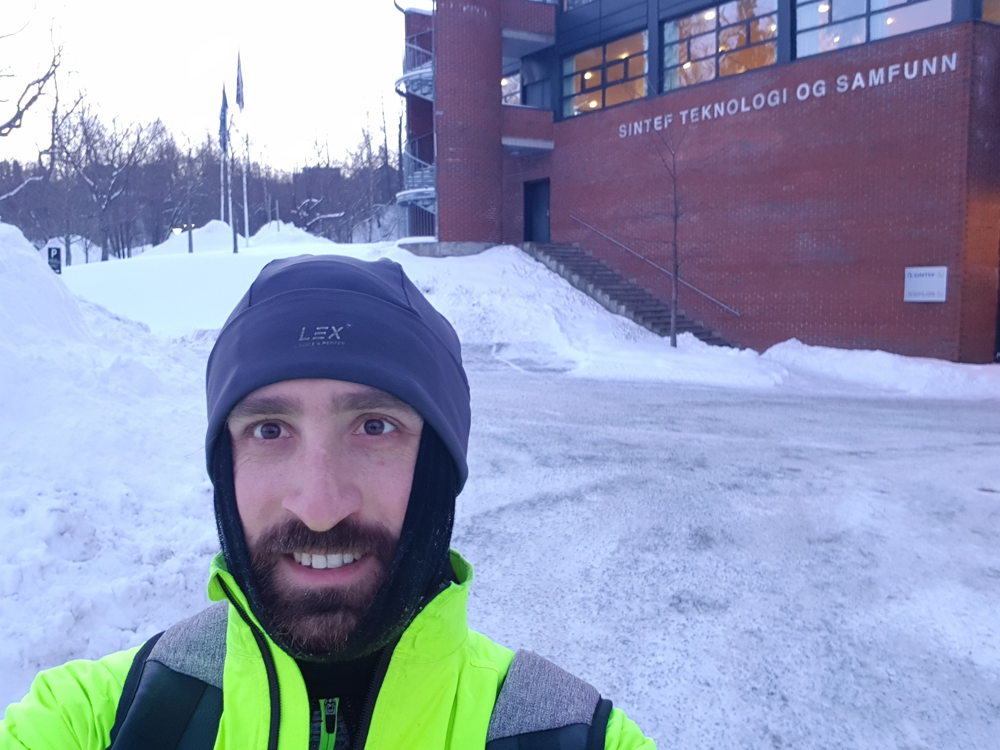

## Assistant Professor -- TU Eindhoven

Since September 2020, I am working as Assistant Professor (or [Universitair Docent](https://nl.wikipedia.org/wiki/Universitair_docent)) at the [Process Analytics (PA) group](https://pa.win.tue.nl/) of the Eindhoven University of Technology. The PA group is lead by Boudewijn van Dongen and was born out of the AIS group in which I obtained my PhD.

* [Personal page at TU/e](https://www.tue.nl/en/research/researchers/felix-mannhardt/)
* [PA group website](https://pa.win.tue.nl/)

## Co-founder -- KIT-AR

I co-founded [KIT-AR](https://www.kit-ar.com/), a spin-off company building an innovate industrial AR solution. Here the focus of my work is the combination of machine learning to detect and identify relevant activities (activity recognition) and a process-centric view on the work execution (workflow management, process mining) paired with an augmented reality system.

* [KIT-AR website](https://www.kit-ar.com/)

## Previous jobs

### Part-time Associate Professor -- NTNU

I was appointed as a [part-time Associate Professor](https://www.ntnu.edu/employees/felix.mannhardt) (Førsteamanuensis II) in Process Analytics and Process Mining at the Department of Computer Science of the NTNU University in Trondheim from 2019 to 2020.

### Forsker -- SINTEF

I was working as Research Scientist (Forsker) at the [Department of Technology Management](https://www.sintef.no/en/technology-and-society/industrial_management/) of [SINTEF Digital](https://www.sintef.no/en/digital/) in beautiful Trondheim, Norway from 2017 to 2020.

