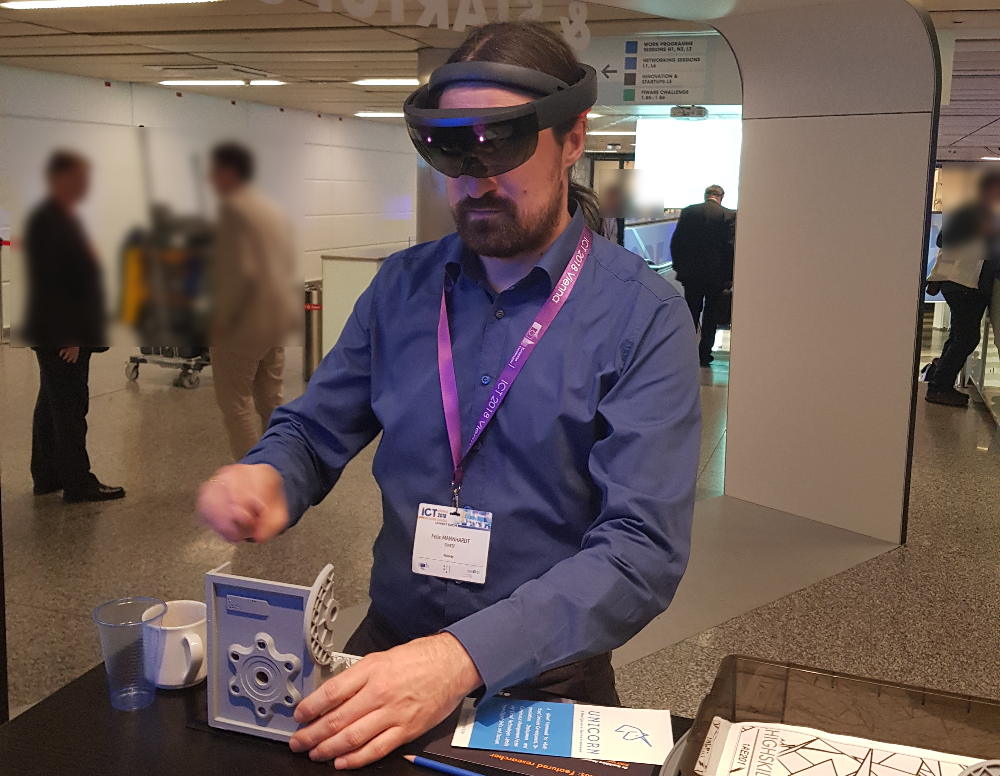

### Forsker -- SINTEF

I am working as Research Scientist (Forsker) at the [Department of Technology Management](https://www.sintef.no/en/technology-and-society/industrial_management/) of [SINTEF Digital](https://www.sintef.no/en/digital/) in beautiful Trondheim, Norway.

### Co-founder -- KIT-AR

I co-founded [KIT-AR](https://www.kit-ar.com/), a spin-off company building an innovate industrial AR solution. Here the focus of my work is the combination of machine learning to detect and identify relevant activities (activity recognition) and a process-centric view on the work execution (workflow management, process mining) paired with an augmented reality system.

### Part-time Associate Professor -- NTNU

I am also a [part-time Associate Professor](https://www.ntnu.edu/employees/felix.mannhardt) (Førsteamanuensis II) in Process Analytics and Process Mining at the Department of Computer Science of the NTNU University in Trondheim.