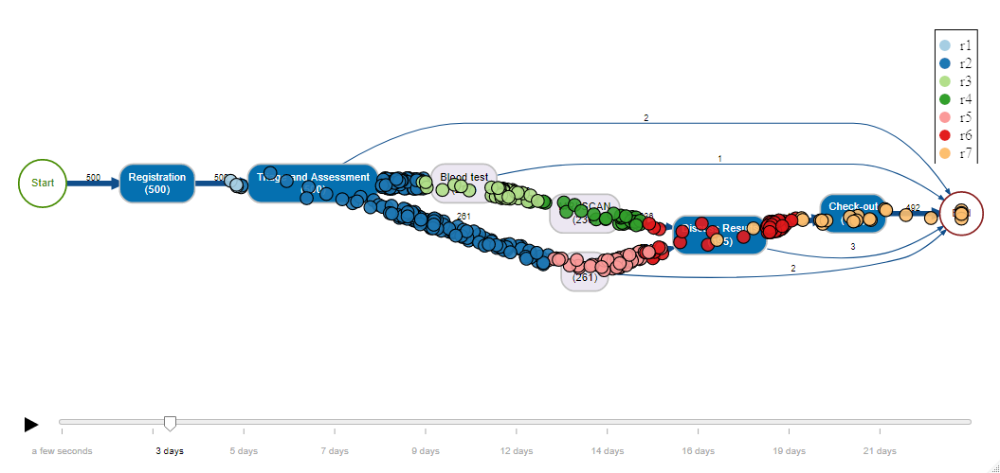

I contribute to the [bupaR](https://www.bupar.net/) collection of Process Mining related R packages:

* [processanimateR](https://github.com/bupaverse/processanimateR). I created and maintain the 'processanimateR' package. This package provides a highly configurable and embeddable SVG token replay animations on top of a bupaR process map. 
* [heuristicsmineR](https://github.com/bupaverse/heuristicsmineR). I created and maintain the 'heuristicsmineR' package. This package provides an efficient R implementation of the Heuristics Miner and several of its variants. 
* [pm4py](https://github.com/bupaverse/pm4py). I created and maintain the R package 'pm4py'. This package provide a bridge between the Python framework [PM4Py](https://github.com/pm4py) and bupaR, which makes it possible to call PM4Py methods directly from R by using the [reticulate](https://github.com/rstudio/reticulate) package.
