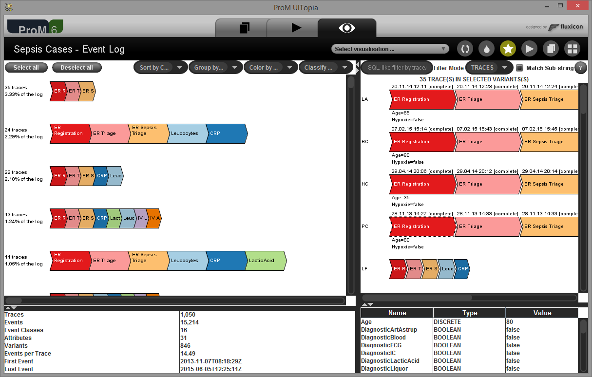

An alternative event log visualization, which handles large event logs efficiently and provides a SQL-like query engine.

<b>ProM Package</b>: <a href="http://www.promtools.org/doku.php?id=nightly">LogEnhancement</a> 
<b>ProM Visualizer</b>: Explore Event Log 
<b>Documentation</b>: to be done 
<b>Sources</b>: <a href="https://svn.win.tue.nl/repos/prom/Packages/LogEnhancement/">ProM SVN</a>
