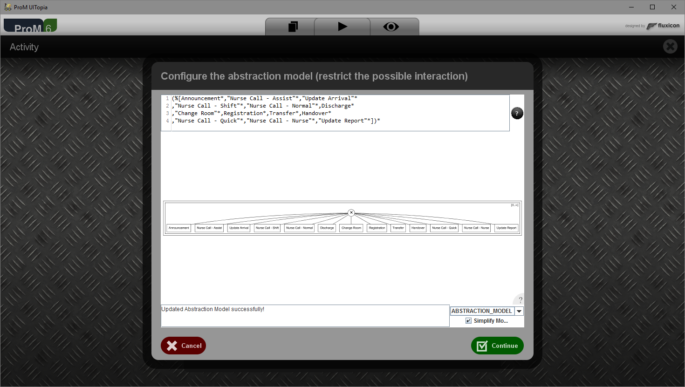

## Overview

A supervised abstraction method based on behavioral activity patterns that capture domain knowledge on the relation between activities and events. Through an alignment between the activity patterns and the low-level event logs an abstracted event log is obtained. Events in the abstracted event log correspond to instantiations of recognizable activities.

## Details

<b>ProM Package</b>: <a href="http://www.promtools.org/doku.php?id=nightly">LogEnhancement</a>  
<b>ProM Plug-ins</b>: Log Abstraction - Abstract Log based on Patterns 
<b>RapidProM Operators</b>: Log Abstraction 
<b>Documentation</b>: to be done 
<b>Sources</b>: <a href="https://svn.win.tue.nl/repos/prom/Packages/LogEnhancement/">ProM SVN</a> · <a href="https://github.com/rapidprom/rapidprom-source/tree/lpm">RapidProM</a>  
<b>Publications</b>:
<ul>
<li><a href="http://dx.doi.org/10.1007/978-3-319-45348-4_8">BPM 2016: From Low-Level Events to Activities - A Pattern-Based Approach</a></a></li>
</ul>