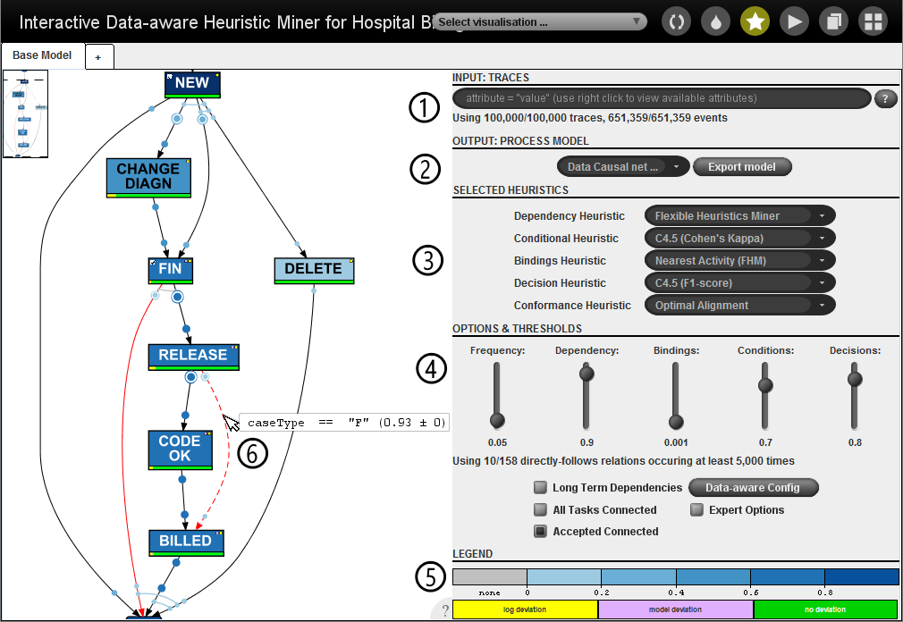
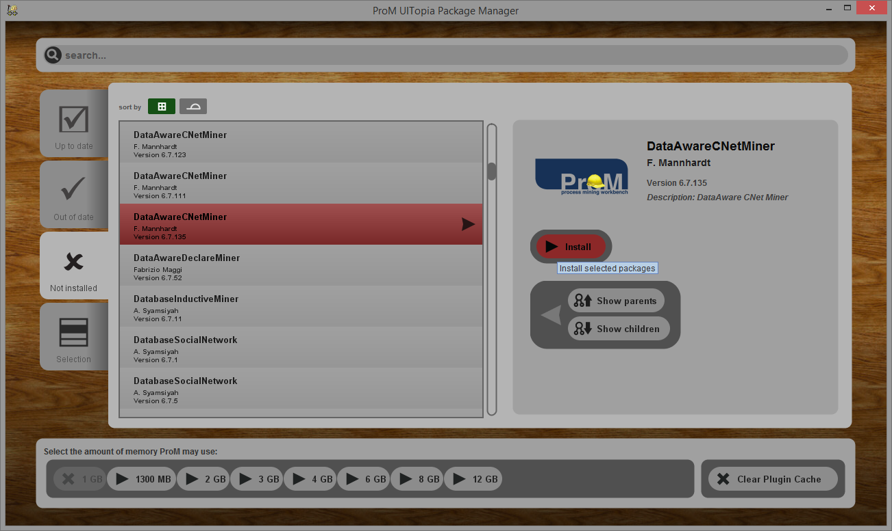
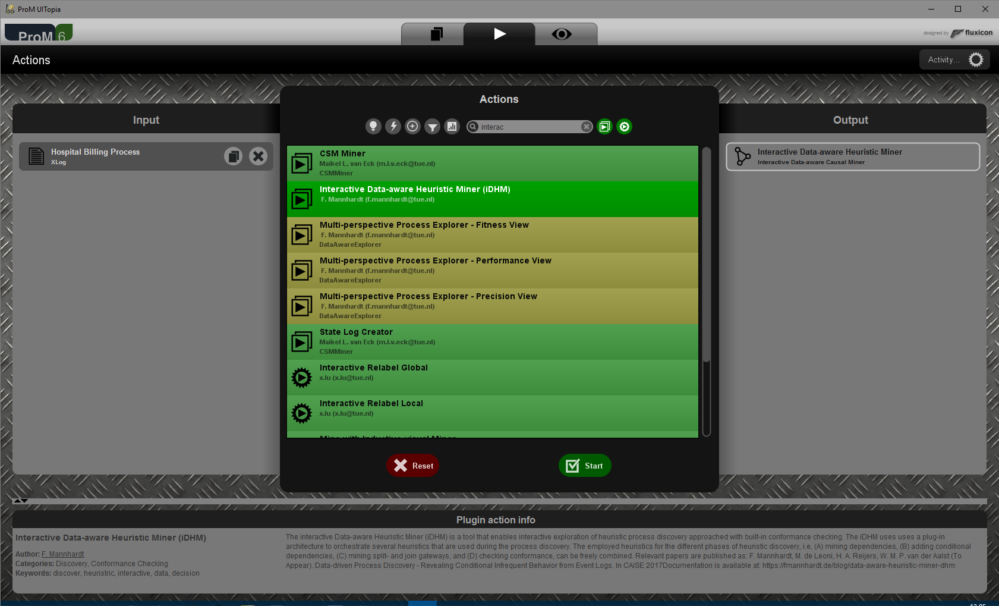
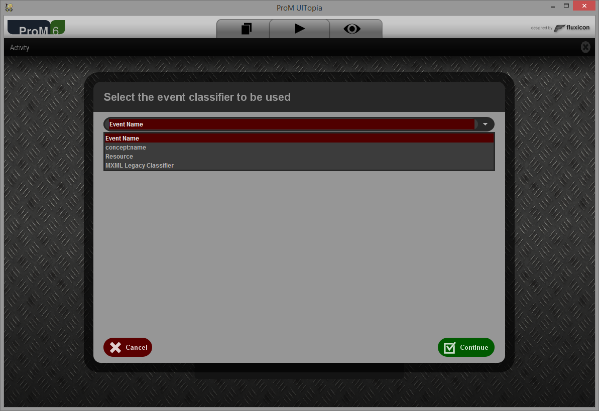
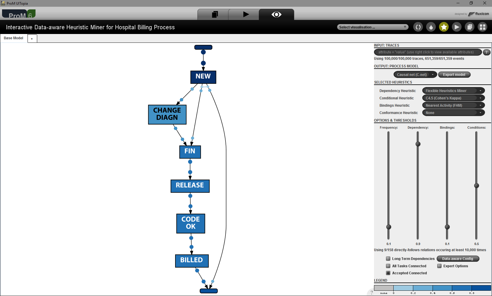
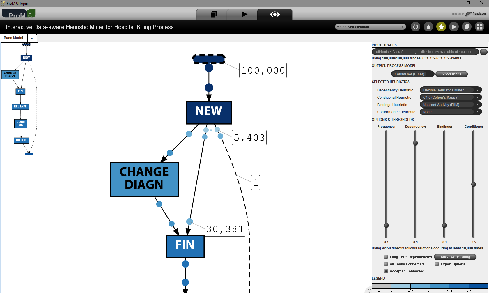
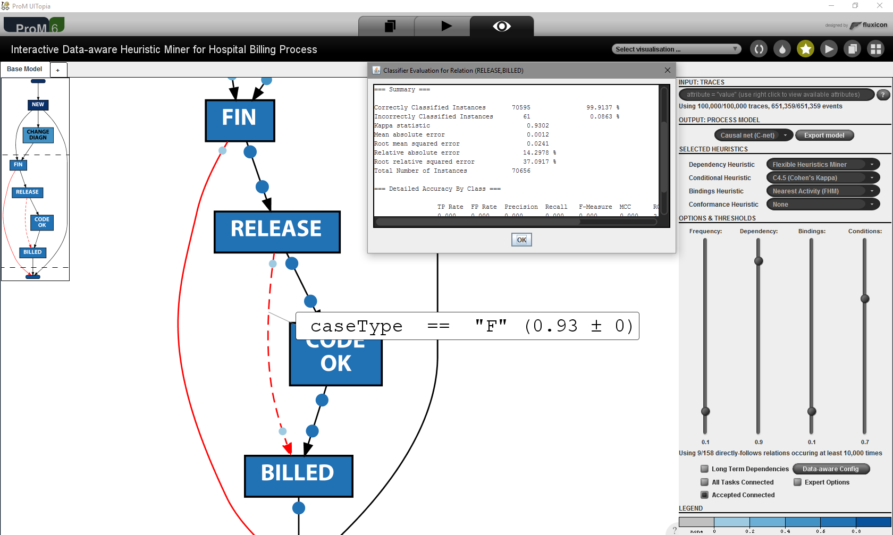
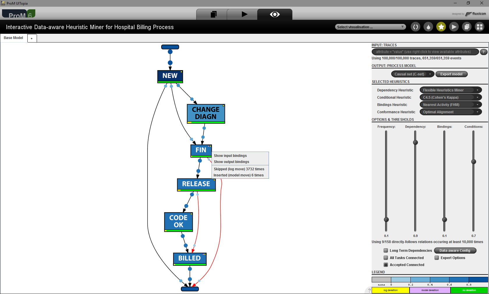
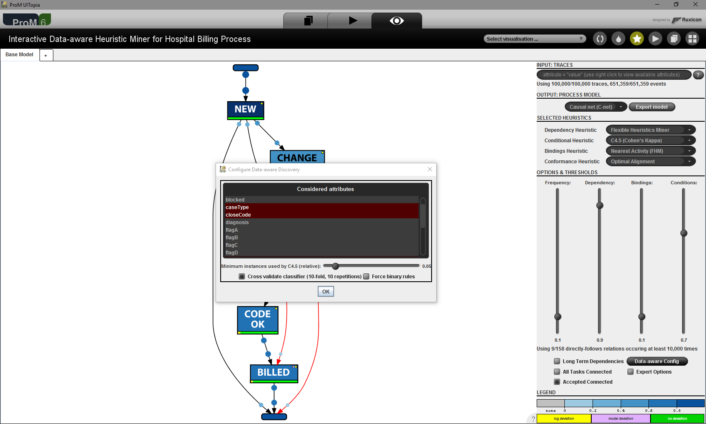

## Overview

An interactive data-aware process discovery tool based on the ideas of the heuristics miner combined with classification techniques. The iDHM implements a process discovery method that uses the data attributes to distinguish infrequent paths from random noise by using classification techniques. Data- and control-flow of the
process are discovered together.

Traces from the event log may be filtered by using a SQL-like query syntax ①. Generally, the output is presented in form of a C-Net, but other output formats such as Petri net or Data Petri net can also be chosen ②. The heuristic used for each step of the iDHM can be configured ③. Several thresholds are used to configure the heuristics ④. At the bottom of the screen a legend explains the used color coding ⑤. Edges can be selected to show more information ⑥.

## Details

<b>ProM Package</b>: <a href="http://www.promtools.org/doku.php?id=nightly">DataAwareCNetMiner</a><br/>
<b>ProM Plug-ins</b>: Interactive Data-aware Heuristic Miner<br/>
<b>Sources</b>: <a href="https://svn.win.tue.nl/repos/prom/Packages/DataAwareCNetMiner/">ProM SVN</a><br/>
<b>Related Publications</b>:
<ul>
<li><a href="https://doi.org/10.4121/uuid:76c46b83-c930-4798-a1c9-4be94dfeb741">Hospital Billing - Event Log.</a> (Event log used in the papers)</li>
<li><a href="http://ceur-ws.org/Vol-1920/BPM_2017_paper_167.pdf">BPM 2017: Heuristic Mining Revamped: An Interactive, Data-aware, and Conformance-aware Miner.</a> (extended version of the tool)</li>
<li><a href="https://link.springer.com/chapter/10.1007%2F978-3-319-59536-8_34">CAiSE 2017: Data-driven Process Discovery - Revealing Conditional Infrequent Behavior from Event Logs</a> (underlying idea & initial version of the tool)</li>
</ul>

## Screencast 

<div align="center"><iframe src="https://player.vimeo.com/video/222103466" width="640" height="360" frameborder="0" webkitallowfullscreen mozallowfullscreen allowfullscreen></iframe></div>

## Installation

Download the currently ProM nightly builder at <a href="http://www.promtools.org/doku.php?id=nightly">promtools.org</a>. Use the ProM package manager to install the package <i>DataAwareCNetMiner</i> (don't ask about why it is named like this). The package should be available in the current ProM nightly build distribution and is scheduled to be released in ProM 6.7.



## Provided Plug-ins
Interactive plug-ins, which provide everything in one interactive tool.
<ul>
<li>Interactive Data-aware Heuristic Miner</li>
</ul>
Non-interactive plug-ins, which provide the option to convert C-Nets to various other representations:
<ul>
<li>Convert Causal net (C-Net) to Petri net</li>
<li>Convert Data-aware Causal Net (DC-Net) to DPN</li>
</ul>

## Usage

The required input for the <i>Interactive Data-aware Heuristic Miner</i> is an event log in XES format. The iDHM is tested with the efficient XES implementation of the XESLite package. The <i>In Memory</i> variant is advisable for most even logs:



Initially, a suitable event classifier that determines which attributes are considered as activity names needs to be selected:



The main user interface of the interactive DHM consists of two panels: the discovered model on the left and the parameter settings on the right. There is also a tab-component on the top, which can be used to instantiate multiple instances of the interactive DHM and quickly remember and compare the obtained results. 



### Discovered Model

The discovered model is visualized using the GraphViz package (thanks <a href="http://www.leemans.ch/">Sander</a>). By default the discovered model is shown as a Causal Net (C-Net). It is possible to zoom, pan, and change various settings of the GraphViz panel. An overview of the settings can be obtained by hovering over the question mark (<b>?</b>) in the lower right corner of the panel.</br> 
Bindings of the C-Net can be selected to obtain more information on the frequency with which a binding was activated. Edges of the C-Net can be selected to obtain the dependency measure score. Moreover, by right-clicking on the activities, a tabular overview on its input- and output bindings can be obtained.



Dependencies that are included based on discovered <b>data conditions</b> are highlighted with red color. For those edges, selection shows the discovered rule, the classification quality measure (which defaults to Cohen's kappa), and the variance of the quality measure over the 10 times 10-fold cross validation. Moreover, with a right-click on the edge, the discovered rule can be further investigated: the classifier can be visualized, detailed evaluation statistics and additional statistics such as the ROC and PRC curve of the underlying classifier can be shown.



Finally, conformance checking techniques can be applied on the C-Net and the event log. Activities and bindings are color-coded based on their frequency of occurrence according to the event log. The size of the binding dots also scales with their frequency of occurrence.</br> 
Moreover, conformance problems are diagnosed: events that are not represented in the model are shown as yellow bar (log move) and activity executions in the model that are not observed in the log as a purple bar (model move). Additionally, we add a small circle of the respective color to the top left of the activity to indicate the presence of conformance issues.



### Configuration



<ul>
<li><b>Input: Traces</b>: Filters full traces based on a SQL-like query language. The help button can be used to get an overview of the syntax. A right-click with the mouse shows the available attributes and vallues that can be filtered on. </li>
<li><b>Output: Process model</b>: Changes the model notation that is shown. The standard choices are:
<ul>
<li>Directly-follows Graph</li>
<li>Dependency Graph</li>
<li>Causal net (C-Net)</li>
<li>Data Causal net (DC-Net)</li>
<li>Data Petri net (DPN)</li>
<li>Petri net</li>
</ul>
Moreover, it is also possible to show the underlying dependency graph, the directly follows relations, and all dependency relations.</li>
<li><b>Export</b>: Exports the model to the ProM workspace.</li>
<li><b>Data-aware Config</b>: Configuration of the classifier used to discover conditional dependencies.</li>
<li><b>Expert Mode</b>: Shows rarely used parameters and expert options</li>
<li><b>Frequency</b>: Adjusts the used observation frequency threshold: θ<sub>obs</sub></li>
<li><b>Dependency</b>: Adjusts the used dependency threshold: θ<sub>dep</sub></li>
<li><b>Bindings</b>: Adjusts the used binding threshold: θ<sub>bin</sub></li>
<li><b>Conditions</b>: Adjusts the used data condition threshold: θ<sub>con</sub></li>
<li><b>Decisions</b>: Adjusts the used data condition threshold: θ<sub>con</sub></li>
<li><b>Long Term</b>: Activates the standard Long-term-dependency heuristic.</li>
<li><b>All Tasks Connected</b>: Activates the standard All-tasks-connected heuristic, i.e., all activities are shown and connected, regardless of the thresholds.</li>
<li><b>Accepted Connected</b>: Activates the Accepted-connected heuristic, i.e., only the minimum number of activities and dependencies that do not fulfill the threshold are added. </li>
</ul>

### Plug-in Development

Plug-ins need to be annotated with the following two Java annotations:

```
@KeepInProMCache
@HeuristicPlugin
```

There are five types of plug-ins that can be developed for the iDHM. Each type of plug-in needs to implement one of the following interfaces: 
<ul>
<li><a href="https://svn.win.tue.nl/repos/prom/Packages/DataAwareCNetMiner/Trunk/src/org/processmining/dataawarecnetminer/extension/dependencies/DependencyHeuristicExtension.java">DependencyHeuristicExtension</a></li>
<li><a href="https://svn.win.tue.nl/repos/prom/Packages/DataAwareCNetMiner/Trunk/src/org/processmining/dataawarecnetminer/extension/conditionaldependencies/ConditionalDependencyHeuristicExtension.java">ConditionalDependencyHeuristicExtension</a></li>
<li><a href="https://svn.win.tue.nl/repos/prom/Packages/DataAwareCNetMiner/Trunk/src/org/processmining/dataawarecnetminer/extension/bindings/BindingsHeuristicExtension.java">BindingsHeuristicExtension</a></li>
<li><a href="https://svn.win.tue.nl/repos/prom/Packages/DataAwareCNetMiner/Trunk/src/org/processmining/dataawarecnetminer/extension/decision/DecisionHeuristicExtension.java">DecisionHeuristicExtension</a></li>
<li><a href="https://svn.win.tue.nl/repos/prom/Packages/DataAwareCNetMiner/Trunk/src/org/processmining/dataawarecnetminer/extension/conformance/ConformanceHeuristicExtension.java">ConformanceHeuristicExtension</a></li>
</ul>
There are also abstract default implementations available for each of these interfaces, which may simply the implementation of the required methods. As an example, Flexible Heuristics Miner plug-in is implemented as follows:

```
package org.processmining.dataawarecnetminer.extension.dependencies;

import org.processmining.dataawarecnetminer.common.MinerContext;
import org.processmining.dataawarecnetminer.extension.DefaultHeuristicPlugin;
import org.processmining.dataawarecnetminer.extension.HeuristicPlugin;
import org.processmining.dataawarecnetminer.interactive.methods.MethodConfiguration;
import org.processmining.dataawarecnetminer.mining.classic.HeuristicsCausalGraphBuilder;
import org.processmining.dataawarecnetminer.model.DependencyAwareCausalGraph;
import org.processmining.dataawarecnetminer.model.EventRelationStorage;
import org.processmining.framework.plugin.annotations.KeepInProMCache;

@KeepInProMCache
@HeuristicPlugin
@DefaultHeuristicPlugin
public class DependencyHeuristicExtensionFHMImpl extends DefaultDependencyHeuristicFactory {

	private static class DependencyHeuristicFHMImpl extends DefaultDependencyHeuristic {

		private HeuristicsCausalGraphBuilder fhmGraphBuilder;

		public DependencyHeuristicFHMImpl(EventRelationStorage eventStorage) {
			super();
			this.fhmGraphBuilder = new HeuristicsCausalGraphBuilder(eventStorage);
		}

		public DependencyAwareCausalGraph computeDependencies(MinerContext context, MethodConfiguration configuration) {
			fhmGraphBuilder.setConfig(configureHeuristicCausalGraphMiner(configuration));
			return fhmGraphBuilder.build(context);
		}

		protected DependencyHeuristicConfig configureHeuristicCausalGraphMiner(MethodConfiguration configuration) {
			DependencyHeuristicConfig config = new DependencyHeuristicConfig();
			config.setDependencyThreshold(configuration.getDependencyThreshold());
			config.setL1Threshold(configuration.getL1Threshold());
			config.setL2Threshold(configuration.getL2Threshold());
			config.setRelativeToBestThreshold(configuration.getRelativeToBestThreshold());

			config.setObservationThreshold(configuration.getFrequencyThreshold());
			config.setAllTasksConnected(configuration.isAllTasksConnected());
			config.setAcceptedTasksConnected(configuration.isAcceptedTasksConnected());
			return config;
		}

	}

	public DependencyHeuristic newInstance(EventRelationStorage eventStorage) {
		return new DependencyHeuristicFHMImpl(eventStorage);
	}

	public String getName() {
		return "Flexible Heuristics Miner";
	}

	public String getReference() {
		return "AJMM Weijters, JTS Ribeiro. Flexible Heuristic Miner. DOI: 10.1109/CIDM.2011.5949453";
	}

}
```