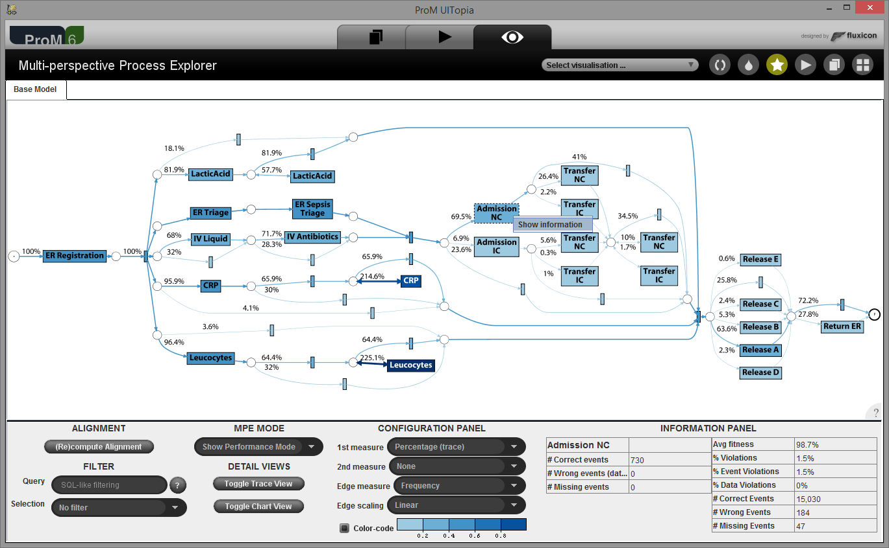
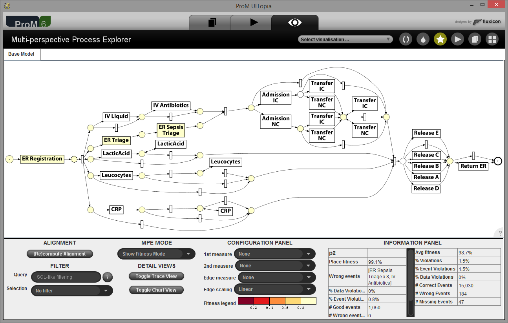
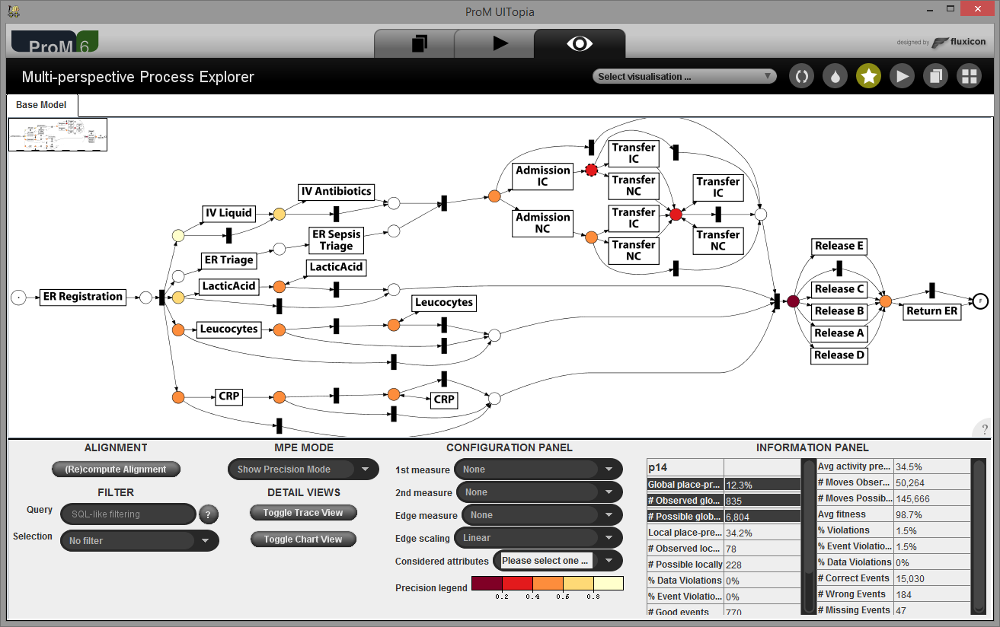
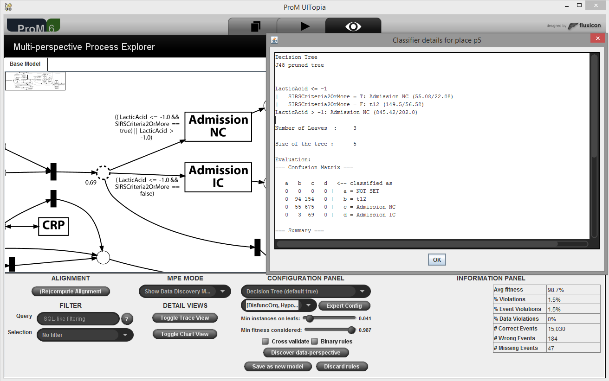
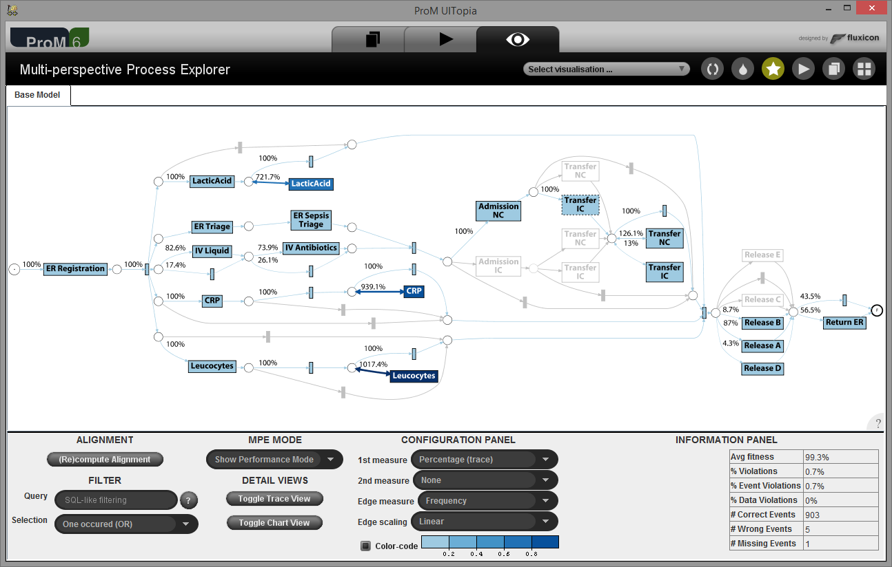
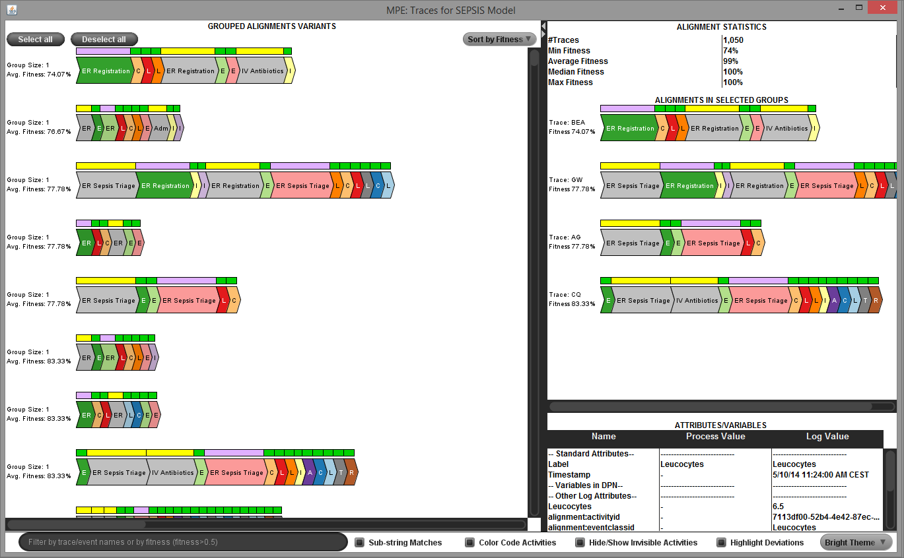
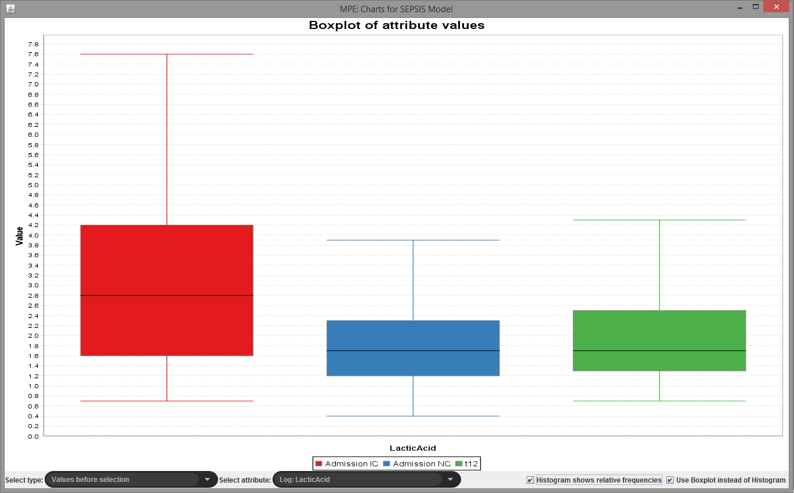

## Overview

An interactive tool integrating conformance checking (fitness & precision), decision mining and performance analysis for multi-perspective process models.

<b>ProM Package</b>: <a href="http://www.promtools.org/doku.php?id=nightly">DataAwareExplorer</a> 
<b>ProM Plug-ins</b>: Multi-perspective Process Explorer 
<b>Documentation</b>: <a href="https://svn.win.tue.nl/repos/prom/Documentation/Package%20DataAwareExplorer.pdf">Package Manual</a> 
<b>Sources</b>: <a href="https://svn.win.tue.nl/repos/prom/Packages/DataAwareExplorer/">ProM SVN</a> 
<b>Related Publications</b>:
<ul>
<li><a href="http://ceur-ws.org/Vol-1418/paper27.pdf">BPM 2015 Demos: The Multi-perspective Process Explorer</a></li>
<li><a href="http://dx.doi.org/10.1007/s00607-015-0441-1">Computing Journal: Balanced Multi-perspective Process Conformance Checking</a></li>
<li><a href="http://dx.doi.org/10.1007/978-3-319-39696-5_23">CAiSE 2016: Decision Mining Revisited - Discovering Overlapping Rules</a></li>
<li><a href="http://dx.doi.org/10.1007/978-3-319-42887-1_10">BPI 2015: Measuring the Precision of Multi-perspective Process Models.</a></li>
</ul>

## Screencast

<iframe src="https://player.vimeo.com/video/222103252" width="640" height="360" frameborder="0" webkitallowfullscreen mozallowfullscreen allowfullscreen></iframe>

## Screenshots

Fitness diagnostics

Precision diagnostics

Decision mining

Conformance-aware Filtering

Trace conformance diagnostics

Context-sensitive charts