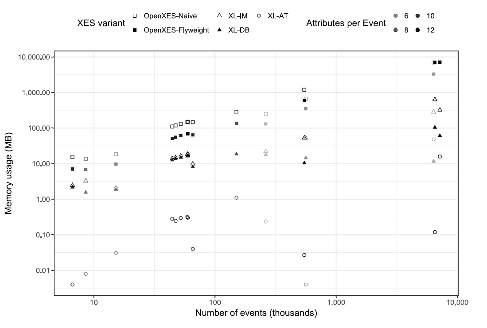

An efficient XES implementation to be used with medium-sized event logs that are too large for in-memory processing with the OpenXES implementation.  
<b>ProM Package</b>: <a href="http://www.promtools.org/doku.php?id=nightly">XESLite</a> 
<b>ProM Plug-ins</b>: XES importers: MapDB, In-Memory, Automaton-based 
<b>Documentation</b>: <a href="https://svn.win.tue.nl/repos/prom/Documentation/Package%20XESLite.pdf">Package Manual</a>  
<b>Sources</b>: <a href="https://svn.win.tue.nl/repos/prom/Packages/XESLite/">ProM SVN</a> · <a href="https://github.com/fmannhardt/xeslite">Github</a> 
<b>Publications</b>:
<ul>
<li>BPM Center Report: <a href="http://bpmcenter.org/wp-content/uploads/reports/2016/BPM-16-04.pdf">XESLite - Managing Large XES Event Logs in ProM</a></li>
<li>AIS Meeting Presentation: <a href="http://www.win.tue.nl/ais/lib/exe/fetch.php?media=documents:xeslite.pdf">XESLite Overview</a></li>
</ul>